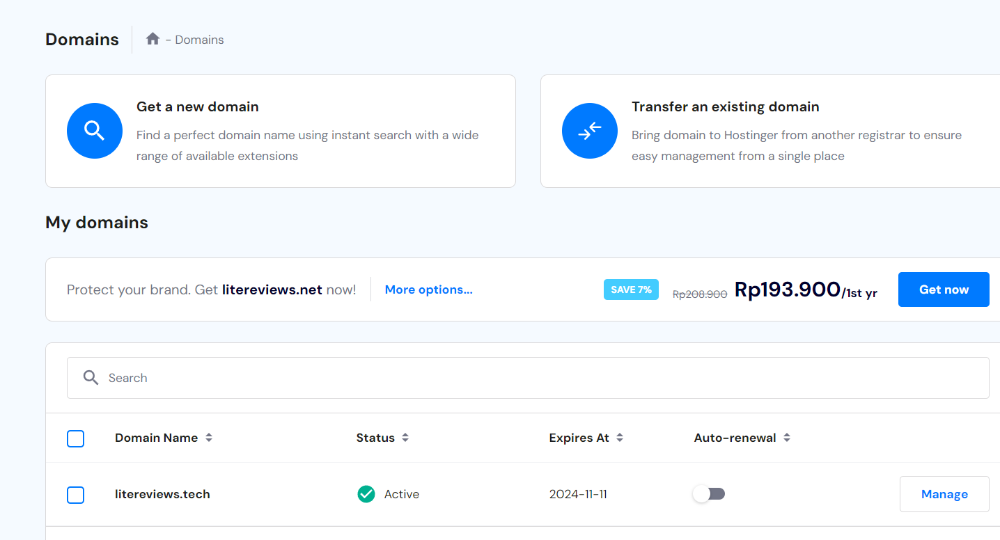
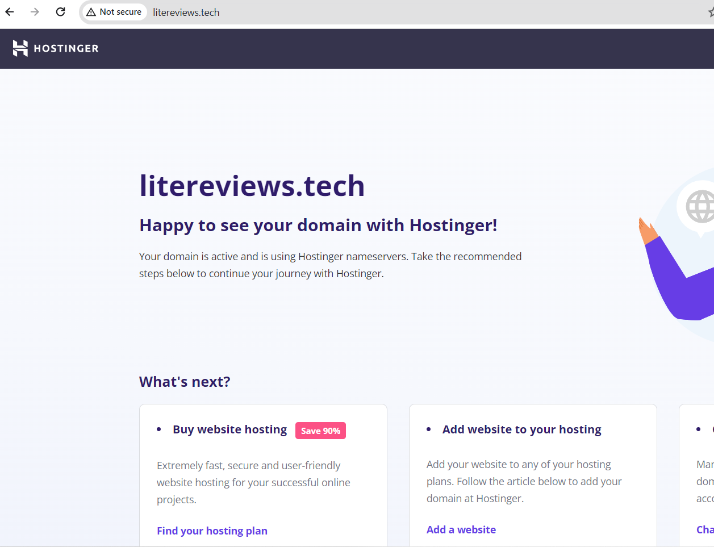
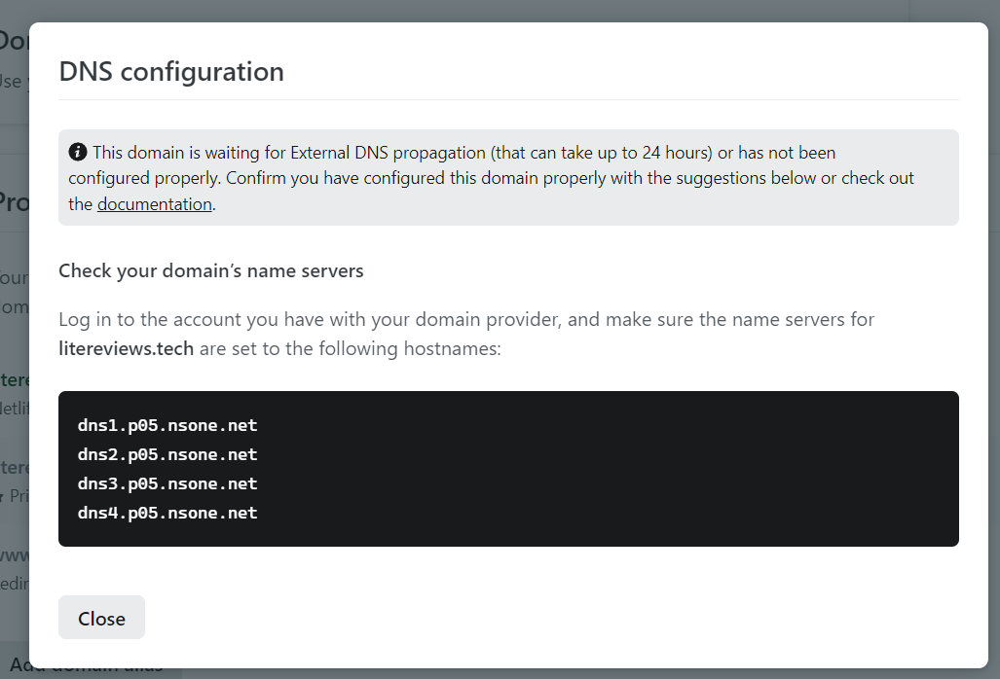

Week 4 Update: Deployment

Netlify Domain Name
litereviews.netlify.app

Custom Domain Name
litereviews.tech

Step 1: Register to NiagaHoster

Step 2: Connect the Domain to Netlify
! [NetlifyConnect](2_ConnectDomaintoNetlify.png)

Step 3: Connected to NiagaHoster and waiting for DNS confirmation

Step 4: Setting Netlify DNS and waiting for updates
