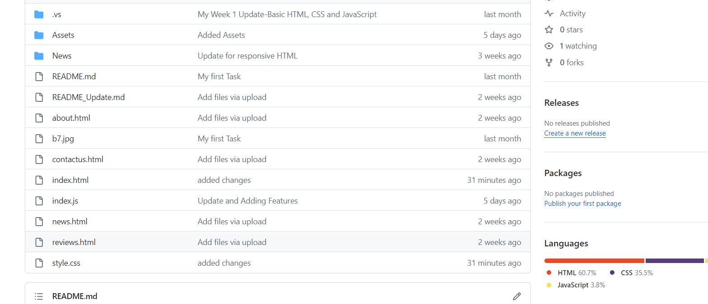
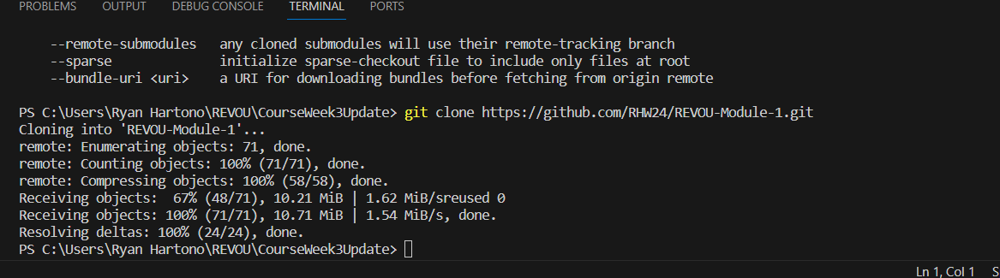
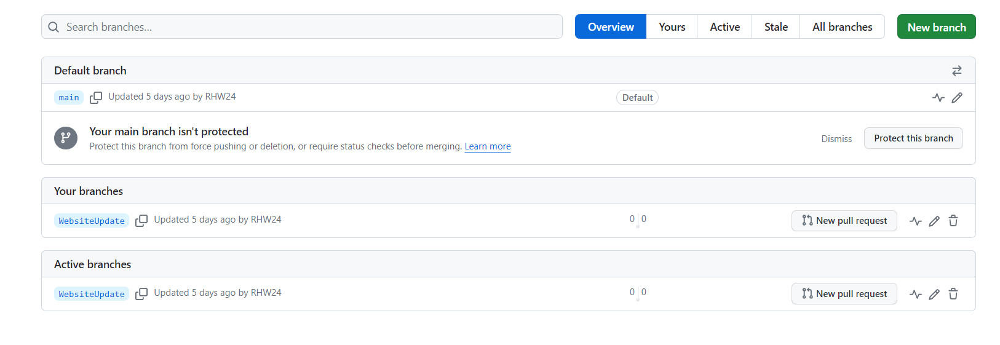
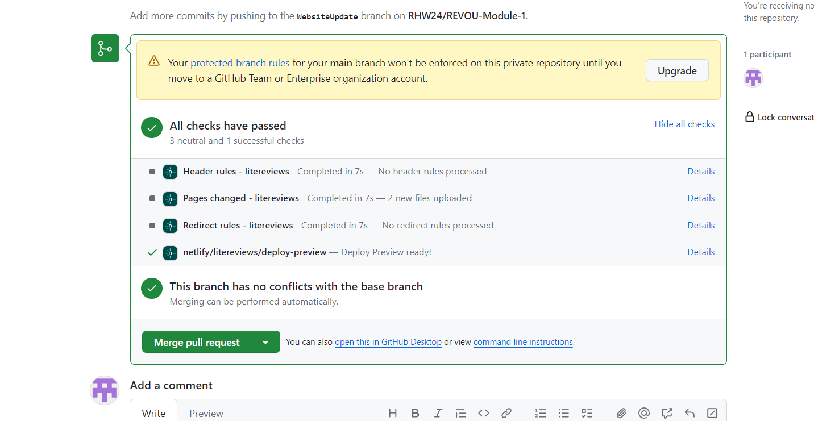
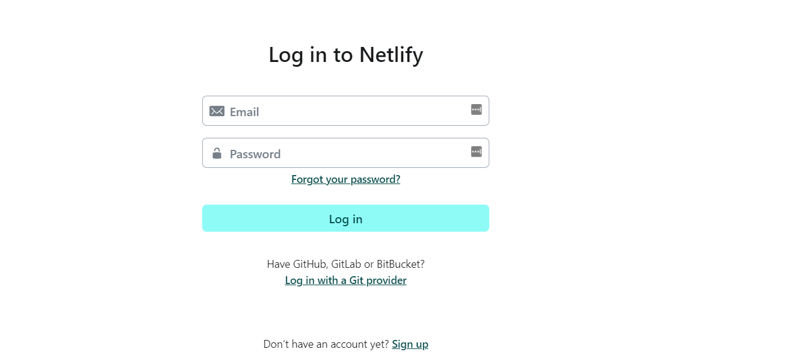
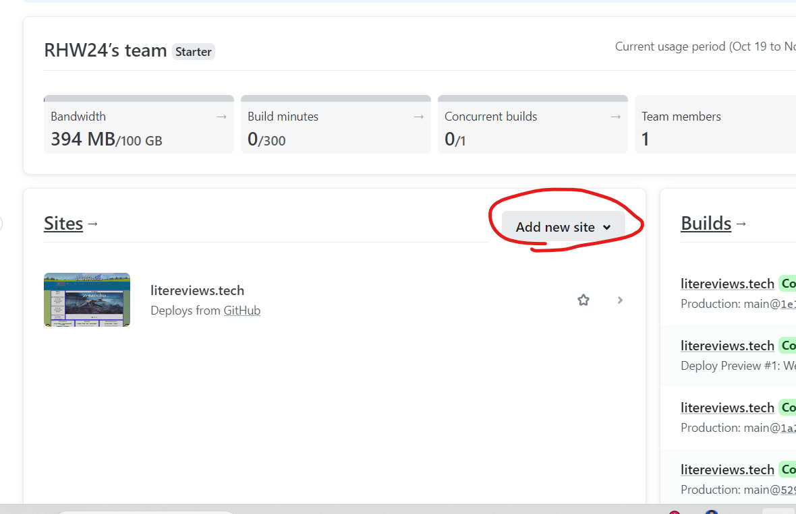
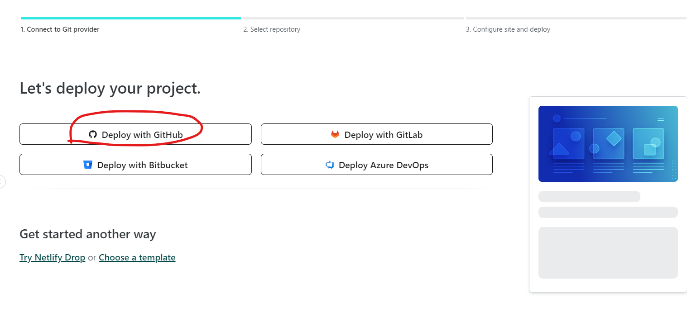
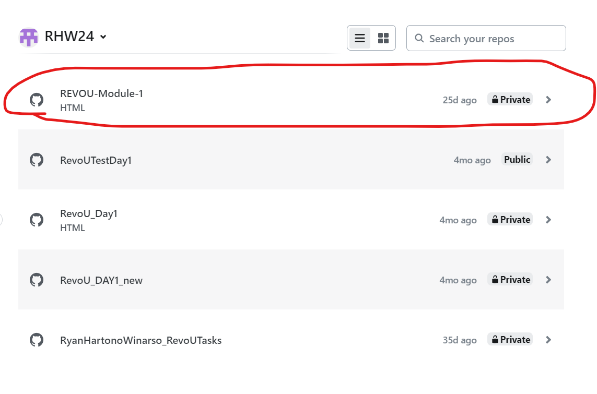
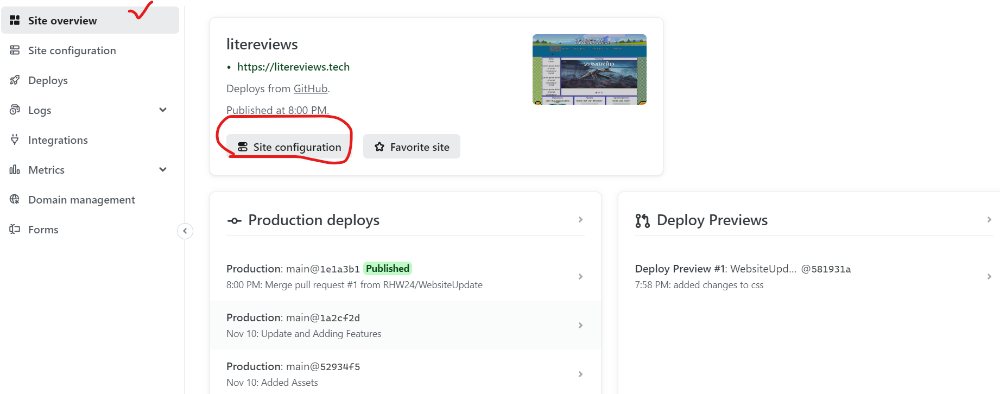
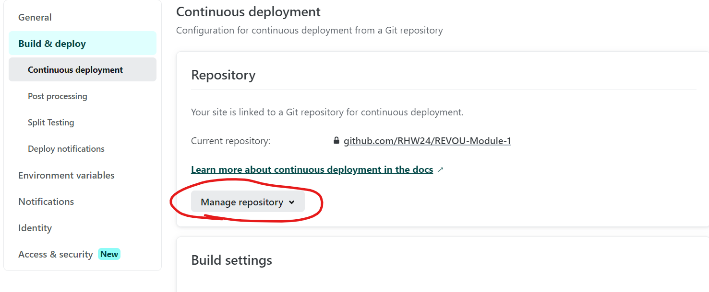

Week 4 Update: Deployment

Netlify Domain Name
litereviews.netlify.app

Custom Domain Name
litereviews.tech

Deployment Workflow
Step 1: Login to Github and Add the Project for the first time

Step 2: Clone the REPO

Step 3: Add new branch to the remote repo so we can use temporary changes before adding to the main branch

Step 4: Merge the changes if there is any (Netlify will auto-update after the merge)

Step 5: Register to Netlify

Step 6: Click the New Site to add your Github Repo

Step 7: Just Follow the Steps (example is using Github Repo to deploy the site)

Step 8: Choose the GitHub Repo that we want to use for the deployment

Step 9 (Optional) : After the deployment we can use this "Site Configuration" option to change any content related to the will-be-deployed website

Step 10 (Optional): If you want to change the repo, just use this function on Netlify

Step 11: Register to NiagaHoster

Step 12: Connect the Domain to Netlify
! [NetlifyConnect](2_ConnectDomaintoNetlify.png)

Step 13: Connected to NiagaHoster and waiting for DNS confirmation

Step 14: Setting Netlify DNS and waiting for updates

Step 15: The Website will be ready to use after the waiting process (up to 24 hrs)
